<p align="center">
  
</p>

<p align="center">
  <a href="mailto:e1756704332@live.uleam.edu.ec"></a>
  <a href="https://github.com/CLOG-U"></a>
  
</p>

# `01 // Punto de partida`

Soy **Carlos Ortiz**, estudiante de Ingeniería de Software en la **Universidad Laica Eloy Alfaro de Manabí**. Este perfil no pretende ser una lista de tecnologías: es una bitácora de lo que aprendo, lo que construyo y lo que logro explicar después de construirlo.

Actualmente curso el **quinto semestre** y concentro mi crecimiento en tres líneas:

```text
software que resuelve problemas
           ↓
datos que ayudan a decidir
           ↓
IA aplicada con responsabilidad
```

Vivo en **Manta, Ecuador**, y me interesa participar en proyectos donde pueda combinar desarrollo, análisis, comunicación técnica y trabajo en equipo.

---

# `02 // Cómo trabajo`

<table>
<tr>
<td width="33%" valign="top">

### 1. Entender

Antes de programar, intento traducir el problema a reglas, actores, datos y decisiones. Me interesa saber **qué debe resolver el sistema y por qué importa**.

</td>
<td width="33%" valign="top">

### 2. Construir

Paso de la idea a prototipos funcionales usando frontend, backend, bases de datos, pruebas y despliegue. Prefiero soluciones demostrables sobre conceptos aislados.

</td>
<td width="33%" valign="top">

### 3. Explicar

Un proyecto no termina cuando ejecuta. También debe poder presentarse, justificarse y ser entendido por profesores, compañeros, usuarios o jurados.

</td>
</tr>
</table>

> Mi objetivo es convertirme en un ingeniero capaz de conectar la parte técnica con el problema real, no solamente escribir código.

---

# `03 // Mapa de construcción`

<table>
<tr>
<td><strong>Base</strong></td>
<td>Python · Java · JavaScript · TypeScript · SQL · HTML · CSS</td>
</tr>
<tr>
<td><strong>Aplicaciones</strong></td>
<td>React · Next.js · Vite · FastAPI · Node.js</td>
</tr>
<tr>
<td><strong>Datos</strong></td>
<td>PostgreSQL · MySQL · Supabase · pandas · NumPy · scikit-learn · Orange</td>
</tr>
<tr>
<td><strong>Infraestructura</strong></td>
<td>Docker · GitHub · Render · Vercel · Netlify</td>
</tr>
<tr>
<td><strong>Calidad</strong></td>
<td>Git · GitHub Actions · SonarQube · pruebas y documentación técnica</td>
</tr>
<tr>
<td><strong>IA asistida</strong></td>
<td>Codex · Claude · Gemini · Cursor · Groq</td>
</tr>
</table>

<p align="center">
  
</p>

La IA forma parte de mi flujo como herramienta de investigación, prototipado, revisión y aprendizaje. Procuro usarla como apoyo para pensar mejor, no como sustituto del criterio técnico.

---

# `04 // Expedientes de proyecto`

## `CASE_001` — FraudIA Claims

**Contexto:** reto de Aseguradora del Sur dentro de la HackIAthon, desarrollado junto al equipo **Manta Bytes**.

**Problema:** revisar reclamos de seguros con información dispersa, documentos, narrativas y posibles patrones anómalos puede ser lento y difícil de justificar.

**Respuesta construida:** una plataforma que prioriza siniestros mediante reglas explicables, detección de anomalías, análisis narrativo y NLP. El sistema genera señales para revisión humana; no acusa fraude ni toma decisiones automáticas sobre pagos.

**Lo que representa en mi proceso:** fue una experiencia de integración completa: frontend, API, datos, lógica de riesgo, documentación, despliegue y presentación ante jurados.

```text
entrada de datos → score trazable → alertas → expediente → decisión humana
```

**Tecnologías:** React · TypeScript · Vite · FastAPI · Python · PostgreSQL · Supabase · Machine Learning · NLP

<p>
  <a href="https://github.com/CLOG-U/retoaseguradora"></a>
  <a href="https://fraudia-frontend.onrender.com"></a>
</p>

---

## `CASE_002` — CareGuide AI

**Contexto:** proyecto de HealthTech desarrollado para un reto de HackIAthon junto al Club de Inteligencia Artificial de la ULEAM.

**Problema:** antes de atenderse, un paciente puede no saber qué especialidad necesita, cuánto podría pagar o qué hospital de su red le conviene.

**Respuesta construida:** un agente que recibe síntomas, propone una especialidad, consulta la cobertura disponible y estima el copago y la alternativa hospitalaria más conveniente.

**Lo que representa en mi proceso:** aprendí a conectar una interfaz conversacional con reglas de negocio, datos de cobertura, backend y una respuesta comprensible para el usuario.

```text
síntomas → orientación → cobertura → copago → hospital recomendado
```

**Tecnologías:** Next.js · React · FastAPI · Python · Supabase · PostgreSQL · Groq · Agno

<p>
  <a href="https://github.com/Erickelrojo-22/HackIAthon-Manta-Bytes---CLUB-IA-ULEAM-main"></a>
</p>

---

# `05 // Principios que quiero mantener`

```python
mi_forma_de_trabajar = {
    "aprender": "entender antes de repetir",
    "construir": "probar ideas con software funcional",
    "colaborar": "comunicar y escuchar al equipo",
    "usar_ia": "acelerar sin perder criterio",
    "mejorar": "documentar errores y convertirlos en experiencia",
}
```

- No presentar una tecnología como dominio absoluto si todavía estoy aprendiéndola.
- Dar crédito al equipo y distinguir claramente mi participación.
- Priorizar proyectos que puedan demostrarse y explicarse.
- Mejorar tanto el código como la forma de comunicar su valor.

---

# `06 // Señales de progreso`

<p align="center">
  
  
</p>

<p align="center">
  
</p>

Las estadísticas muestran actividad; los expedientes anteriores muestran mejor qué estoy aprendiendo a hacer con ella.

---

# `07 // Próxima versión`

Actualmente estoy fortaleciendo:

- arquitectura y diseño de software;
- desarrollo backend con Python y FastAPI;
- modelado y análisis de datos;
- pruebas, calidad y despliegue;
- comunicación técnica para proyectos académicos y competencias.

Me interesa colaborar en proyectos universitarios, hackathones, soluciones con IA aplicada y oportunidades donde pueda seguir creciendo como desarrollador.

<details>
<summary><strong>English snapshot</strong></summary>
<br />

I'm Carlos Ortiz, a Software Engineering student at ULEAM in Manta, Ecuador. I build university and hackathon projects around software, applied AI and data. My goal is to understand real problems, create functional solutions and communicate clearly how they work and why they matter.

</details>

---

<p align="center">
  <strong>CLOG-U</strong><br />
  <sub>Carlos Luis Ortiz García · Engineering log in continuous development</sub>
</p>
