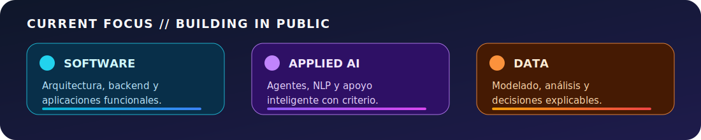

<p align="center">
  
</p>

<p align="center">
  <a href="mailto:e1756704332@live.uleam.edu.ec"></a>
  <a href="https://github.com/CLOG-U"></a>
  
</p>

<p align="center">
  
</p>

<p align="center">
  
</p>

# `01 // INICIO DE SESIÓN`

```yaml
usuario: Carlos Luis Ortiz García
ubicación: Manta, Ecuador
formación: Ingeniería de Software · ULEAM · quinto semestre
misión: convertir problemas reales en sistemas claros, útiles y demostrables
estado: aprendiendo y construyendo
```

Soy **Carlos Ortiz**. Este perfil funciona como mi bitácora de ingeniería: registra proyectos, decisiones, aprendizajes y las áreas que voy fortaleciendo mientras avanzo en mi formación.

<table>
<tr>
<td align="center"><strong>🧠 ENTENDER</strong><br/><sub>Problema, usuarios, datos y reglas.</sub></td>
<td align="center"><strong>⚙️ CONSTRUIR</strong><br/><sub>Prototipos funcionales de extremo a extremo.</sub></td>
<td align="center"><strong>🎙️ EXPLICAR</strong><br/><sub>Comunicar cómo funciona y por qué importa.</sub></td>
</tr>
</table>

> **No quiero limitarme a escribir código: quiero aprender a conectar tecnología, decisiones y necesidades reales.**

---

# `02 // STACK EN MOVIMIENTO`

<p align="center">
  
</p>

<table>
<tr>
<td width="50%" valign="top">

### 🟦 Construcción de software

`Python` `Java` `JavaScript` `TypeScript`  
`React` `Next.js` `Vite` `FastAPI` `Node.js`

Me interesa integrar interfaces, lógica de negocio, APIs, datos y despliegue en una solución completa.

</td>
<td width="50%" valign="top">

### 🟪 Datos e inteligencia artificial

`PostgreSQL` `MySQL` `Supabase`  
`pandas` `NumPy` `scikit-learn` `Orange` `NLP`

Trabajo en análisis, modelado y soluciones de IA que apoyen decisiones explicables.

</td>
</tr>
<tr>
<td width="50%" valign="top">

### 🟧 Entrega y calidad

`Docker` `Render` `Vercel` `Netlify`  
`Git` `GitHub Actions` `SonarQube`

Busco que los proyectos no solo funcionen localmente, sino que puedan probarse, revisarse y mantenerse.

</td>
<td width="50%" valign="top">

### 🟩 Herramientas de IA

`Codex` `Claude` `Gemini` `Cursor` `Groq`

Las uso para investigar, prototipar, revisar y aprender más rápido, conservando el criterio sobre las decisiones técnicas.

</td>
</tr>
</table>

---

# `03 // PROYECTOS EN PRIMER PLANO`

<table>
<tr>
<td width="50%" valign="top">

## 🛡️ FraudIA Claims


Plataforma construida para priorizar siniestros que requieren revisión mediante reglas explicables, anomalías, análisis narrativo y NLP.

```text
datos
  ↓
score trazable
  ↓
alertas y evidencia
  ↓
revisión humana
```

**Mi aprendizaje principal:** integrar frontend, API, datos, lógica de riesgo, despliegue, documentación y presentación en un mismo proyecto.

**Stack:** React · TypeScript · Vite · FastAPI · Python · PostgreSQL · Supabase · ML · NLP

<p>
  <a href="https://github.com/CLOG-U/retoaseguradora"></a>
  <a href="https://fraudia-frontend.onrender.com"></a>
</p>

</td>
<td width="50%" valign="top">

## 🩺 CareGuide AI


Agente que recibe síntomas, orienta hacia una especialidad, consulta la cobertura y estima copago y hospital recomendado.

```text
síntomas
  ↓
orientación
  ↓
cobertura y copago
  ↓
hospital sugerido
```

**Mi aprendizaje principal:** conectar una interfaz conversacional con reglas, backend, datos de seguros y una respuesta comprensible para el paciente.

**Stack:** Next.js · React · FastAPI · Python · Supabase · PostgreSQL · Groq · Agno

<p>
  <a href="https://github.com/Erickelrojo-22/HackIAthon-Manta-Bytes---CLUB-IA-ULEAM-main"></a>
</p>

</td>
</tr>
</table>

---

# `04 // REGLAS DEL SISTEMA`

```python
carlos = {
    "aprender": "entender antes de repetir",
    "construir": "crear algo que pueda demostrarse",
    "colaborar": "escuchar, comunicar y dar crédito",
    "usar_ia": "acelerar sin entregar el criterio",
    "mejorar": "convertir cada error en documentación",
}
```

<p align="center">
  
  
  
  
</p>

---

# `05 // TELEMETRÍA`

<p align="center">
  
  
</p>

<p align="center">
  
</p>

<p align="center">
  
</p>

---

# `06 // SIGUIENTE ACTUALIZACIÓN`

<table>
<tr>
<td align="center">🏗️<br/><strong>Arquitectura</strong><br/><sub>Diseñar sistemas más claros.</sub></td>
<td align="center">🐍<br/><strong>Backend</strong><br/><sub>Profundizar en Python y FastAPI.</sub></td>
<td align="center">📊<br/><strong>Datos</strong><br/><sub>Modelar y analizar mejor.</sub></td>
<td align="center">🧪<br/><strong>Calidad</strong><br/><sub>Probar, medir y documentar.</sub></td>
<td align="center">☁️<br/><strong>Cloud</strong><br/><sub>Desplegar con más solidez.</sub></td>
</tr>
</table>

Me interesa colaborar en proyectos universitarios, hackathones, soluciones con IA aplicada y oportunidades en las que pueda seguir creciendo como desarrollador.

<details>
<summary><strong>🌎 English snapshot</strong></summary>
<br />

I'm Carlos Ortiz, a Software Engineering student at ULEAM in Manta, Ecuador. I build university and hackathon projects around software, applied AI and data. My goal is to understand real problems, create functional solutions and explain clearly how they work and why they matter.

</details>

---

<p align="center">
  
  <br />
  <strong>CARLOS LUIS ORTIZ GARCÍA</strong><br />
  <sub>CLOG-U · Engineering log · versión en desarrollo continuo</sub>
</p>
